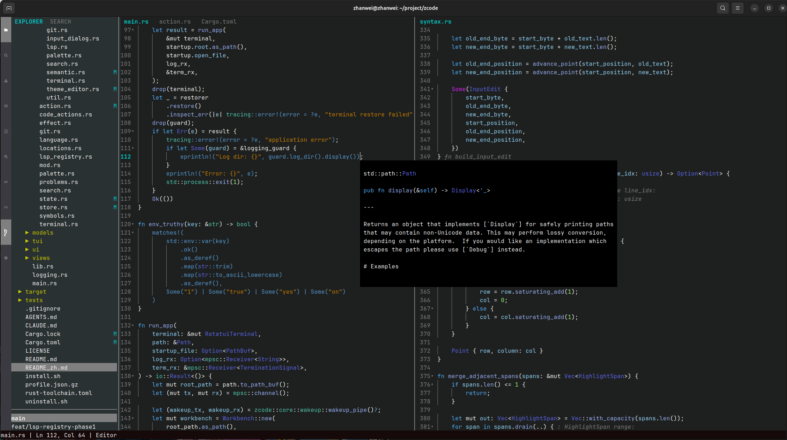

<div align="center">

# zcode

[](https://www.rust-lang.org/)
[](LICENSE)
[](README.md)
[](README_zh.md)

</div>

`zcode` 是一个基于 Rust 开发的现代化、高性能 TUI（终端用户界面）文本编辑器。



## 目录

- [快速开始](#快速开始)
- [安装](#安装)
- [操作指南](#操作指南)
  - [常用快捷键 (Keybindings)](#常用快捷键-keybindings)
  - [鼠标操作](#鼠标操作)
- [核心功能](#核心功能)
- [配置](#配置)
- [常见问题](#常见问题)
- [开发](#开发)
- [License](#license)

## 快速开始

### 环境依赖

* [Rust toolchain](https://rustup.rs/)（推荐使用 `rust-toolchain.toml` 固定的版本）
* Linux: 需要 C 工具链用于链接（例如 `cc`/`gcc`）（用于编译 tree-sitter grammar）
* 终端字体建议使用 Nerd Font（用于显示 UI 图标）
* 可选（用于 LSP 智能功能）：`rust-analyzer`、`gopls`、`pyright-langserver`、`typescript-language-server`、`clangd`、`jdtls`

### 启动编辑器

在项目根目录下运行：

```bash
# 1. 打开当前目录
cargo run

# 2. 显式打开当前目录
cargo run -- .

# 3. 打开指定文件
cargo run -- src/main.rs
```

### 推荐：Release 模式运行

TUI 编辑器在 Debug 模式下可能会因为大量绘制计算显得略有卡顿，推荐使用 Release 模式体验流畅度：

```bash
cargo run --release -- .
```

## 安装

从源码构建并安装到 Cargo 的 bin 目录（通常是 `~/.cargo/bin`）：

```bash
cargo install --path . --locked
zcode
```

也可以使用辅助脚本：

```bash
./install.sh --user
# 或者：sudo ./install.sh --system
```

如果使用 `./install.sh --user`，请确保 `~/.local/bin` 已加入 `PATH`。

## 操作指南

### 常用快捷键 (Keybindings)

默认键位映射如下：

* **通用**:
  
  * `Ctrl + q`: 退出编辑器
  * `Ctrl + s`: 保存当前文件
  * `Ctrl + ,`: 打开设置 (Settings)
  * `Ctrl + b`: 切换侧边栏显示

* **编辑器**:
  
  * `Ctrl + f`: 打开文件内搜索
  * `Ctrl + h`: 打开替换
  * `F3` / `Ctrl + g`: 查找下一个
  * `Shift + F3` / `Ctrl + Shift + g`: 查找上一个
  * `Ctrl + \`: 垂直拆分编辑器 (Split Vertical)
  * `Ctrl + Shift + \`: 关闭拆分的编辑器
  * `Ctrl + Shift + e`: 聚焦文件资源管理器
  * `Ctrl + Shift + f`: 聚焦全局搜索面板

* **标签页**:
  
  * `Ctrl + w`: 关闭当前标签页
  * `Ctrl + Tab`: 切换到下一个标签页
  * `Ctrl + Shift + Tab`: 切换到上一个标签页

* **光标与选区**:
  
  * `Ctrl + a`: 全选
  * `Ctrl + c` / `x` / `v`: 复制 / 剪切 / 粘贴
  * `Ctrl + z`: 撤销
  * `Ctrl + y`: 重做

* **LSP（当对应语言服务可用时）**:
  
  * `F2`: 悬停提示 (Hover)
  * `F12`: 跳转定义 (Go to Definition)
  * `Shift + F12`: 查找引用 (Find References)
  * `Alt + Enter`: Code Action
  * `Ctrl + Space`: 自动补全 (Completion)
  * `Ctrl + Shift + r`: 重命名 (Rename)

### 鼠标操作

`zcode` 对鼠标操作有完善的支持：

* **文件导航**: 在左侧资源管理器中，点击文件夹可展开/折叠，双击文件可打开。
* **标签页管理**: 
  * **左键点击**: 切换标签页。
  * **中键点击**: 关闭标签页。
  * **点击 'x'**: 关闭标签页。
* **分屏调整**: 拖动编辑器之间的分割线可调整分屏大小。
* **光标定位**: 在编辑器区域点击可直接移动光标。

## 核心功能

* **现代化 TUI 编辑器**: 基于 `ratatui` 和 `crossterm` 构建，支持侧边栏、底部面板、多标签页与分屏编辑。
* **多语言语法高亮**: 基于 tree-sitter，为 Rust/Go/Python/JavaScript/TypeScript（含 JSX/TSX）、Java、C、C++ 提供语法高亮兜底。
* **多语言 LSP 支持（可选）**: 为 Rust/Go/Python/JS/TS、Java、C、C++ 提供诊断、悬停、补全、跳转定义等功能。
  * monorepo 友好：按语言“就近 marker”识别 root，并按 (language, root) 启动/复用 server。
  * server 自动发现：优先使用项目内 `node_modules/.bin` 与 Python 虚拟环境（如果存在）。
* **强大的搜索**: 内置基于 `ripgrep` 的高性能全局搜索和文件内实时搜索。
* **键位映射**: 支持灵活的键位绑定配置 (Keybindings)，用户可自定义快捷键。
* **剪贴板集成**: 与系统剪贴板无缝互通。
* **主题编辑器**: 内置可视化主题编辑器，用于自定义语法高亮配色。通过命令面板打开（`Ctrl + Shift + p` > "Open Theme Editor"）。
  * **色彩选择器**: 色相条（竖条）+ 饱和度/亮度色谱面板，点击或拖拽选色，右侧代码预览实时更新。
  * **自动保存**: 颜色修改会自动保存到 `setting.json`（300ms 防抖），无需手动保存。
  * **键盘操作**: `Tab` 切换焦点（Token 列表 / 色相条 / SL 面板）。方向键调节数值（`Shift` 加大步进）。`l` 切换预览语言。`Ctrl + r` 重置当前 Token 为默认颜色。`Esc` 关闭。
  * **鼠标操作**: 点击或拖拽色相条改变色相；点击或拖拽 SL 面板改变饱和度/亮度；点击 Token 列表选择要编辑的语法元素。

## 配置

配置文件位置：

* Linux: `~/.cache/.zcode/setting.json`
* macOS: `~/Library/Caches/.zcode/setting.json`

### LSP 配置

你可以在 `setting.json` 中按语言配置 LSP server 的 command/args，以及可选的 initialize options：

```json
{
  "lsp": {
    "servers": {
      "rust-analyzer": { "command": "rust-analyzer" },
      "gopls": { "command": "/home/you/go/bin/gopls" },
      "pyright": { "command": "pyright-langserver", "args": ["--stdio"] },
      "tsls": {
        "command": "typescript-language-server",
        "args": ["--stdio"],
        "initialization_options": {
          "preferences": {
            "includeCompletionsForModuleExports": true
          }
        }
      }
    }
  }
}
```

对 Go 而言，如果 `gopls` 安装在 `~/go/bin`，建议像上面一样显式配置绝对路径。

## 常见问题

### 目前仅支持unix-like系统

### `error: linker cc not found`

请安装 C 工具链。

* Ubuntu/Debian: `sudo apt install build-essential`
* Fedora/RHEL: `sudo dnf install gcc`
* Arch: `sudo pacman -S base-devel`

### Linux 上剪贴板不可用

请安装以下任意一个：

* Wayland: `wl-clipboard`（`wl-copy` / `wl-paste`）
* X11: `xclip` 或 `xsel`

### LSP server 找不到

`zcode` 默认会启用 LSP，但具体语言 server 是可选的。按需安装：

* Rust（`rust-analyzer`）：
  
  ```bash
  rustup component add rust-analyzer rust-src
  ```

* Go（`gopls`）：
  
  ```bash
  go install golang.org/x/tools/gopls@latest
  ```

* Python（`pyright-langserver`）：
  
  ```bash
  npm i -g pyright
  # 或：pipx install pyright
  ```

* JavaScript/TypeScript（`typescript-language-server`）：
  
  ```bash
  npm i -g typescript-language-server typescript
  # 或项目内：npm i -D typescript-language-server typescript
  ```

* C/C++（`clangd`）：

  从系统 LLVM/Clang 软件包安装（例如 Debian/Ubuntu 上安装 `clangd`）。

* Java（`jdtls`）：

  安装 Eclipse JDT Language Server，并确保 `jdtls` 可通过 `PATH` 访问。

如果 JS/TS 按项目安装，`zcode` 会自动向上查找并使用 `node_modules/.bin`。

### macOS 默认终端鼠标偶尔不响应

macOS默认终端有极小概率出现不响应鼠标的情况，这个是终端的BUG，关掉重开就行

## 开发

```bash
cargo fmt --all -- --check
cargo clippy --all-targets --all-features -- -D warnings
cargo test --all-targets --all-features
```

## License

GPL-3.0，详见 `LICENSE`。
